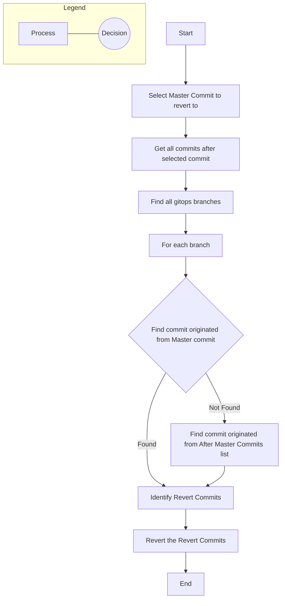
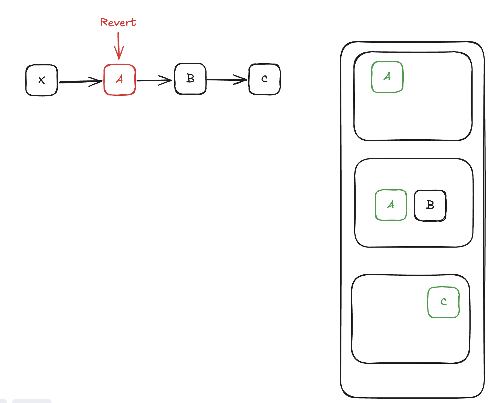

# Reverter

Steps:

0. Select `Master` Commit to revert to
1. Use `GitHub` API to get all commits after the selected commit
2. Use `Git` to find all `gitops` branches
3. On each branch, use `Git` to find the commit that is originated from `Master` commit. If there is no such commit, use commit that is originated from `After Master Commits` list (checking oldest to newest)
4. Find the `Revert Commits` on all branches
5. Use `Git` to revert the `Revert Commits`

## Process Diagram

## Illustration

In this illustration:
- Left side shows the commit chain on master branch (X → A → B → C)
- Red commit (A) represents the commit we want to revert to on the master branch
- Right side shows gitops branches with their commits
- Green commits (A, B, C) represent the commits on gitops branches that need to be reverted

The process will identify commit A on master (marked in red) and then find the corresponding commits on the gitops branches (marked in green) that need to be reverted.

