# GitOps Rollback (hotel-search-web-rollback) 🔄

A Go tool that helps you roll back GitOps deployments to a specific commit state across multiple branches. Think of it like a time machine for your deployments!

## What Does This Do? (Explain Like I'm 5) 👶

Imagine you have a toy box (your main code) and several rooms where you keep different versions of your toys (GitOps branches). Sometimes you put a broken toy in all the rooms, and you want to go back to when all the toys were working.

This tool:
1. **Finds the "good" state** - You tell it which toy version was working (commit hash)
2. **Looks at all the rooms** - It checks all your GitOps branches 
3. **Figures out what to remove** - It finds all the "bad" toys that came after the good one
4. **Cleans up each room** - It removes the bad toys from each room (reverts commits)
5. **Puts everything back** - It pushes the clean rooms back to where they belong

## How It Works 🔧

```mermaid
graph TD
    A[Start: You provide a commit hash] --> B[Get all GitOps branches]
    B --> C[Get master branch commits since X months]
    C --> D[Build commit graph]
    D --> E[For each GitOps branch, find commits that reference master commits]
    E --> F[Find the last commit in each GitOps branch that relates to your target commit]
    F --> G[Identify all commits after that point that need to be reverted]
    G --> H{Rollback mode?}
    H -->|Yes| I[Clone repository]
    H -->|No| J[Just show what would be reverted]
    I --> K[For each branch with commits to revert]
    K --> L[Create worktree]
    L --> M[Revert commits in reverse order]
    M --> N{Push changes?}
    N -->|Yes| O[Push to remote]
    N -->|No| P[Keep changes local]
    O --> Q[Done! 🎉]
    P --> Q
    J --> Q
```



## Key Components 📦

### 1. Main Engine (`main.go`)
- **Command-line interface** - Takes your input parameters
- **Orchestrates the process** - Calls other components in the right order
- **Parallel processing** - Works on multiple branches at the same time for speed
- **Safety checks** - Won't do anything dangerous unless you explicitly say so

### 2. GitHub Integration (`github.go`)
- **Talks to GitHub** - Gets information about branches and commits
- **Smart pagination** - Handles lots of commits efficiently
- **Authentication** - Uses your GitHub token securely

### 3. Git Operations (`git.go`)
- **Repository cloning** - Downloads your code to work with
- **Worktree management** - Creates separate workspaces for each branch
- **Commit reverting** - Actually undoes the unwanted changes
- **Push operations** - Sends changes back to GitHub

### 4. Analysis Engine (`engine.go`)
- **Commit graph building** - Maps relationships between commits
- **Pattern matching** - Finds GitOps commits that reference master commits
- **Rollback calculation** - Figures out exactly what needs to be undone

### 5. Data Types (`types.go`)
- **HeadCommit** - Represents a commit on master with its GitOps relationships
- **GitOpsCommit** - Represents a commit on a GitOps branch
- **RollbackCommit** - Represents what needs to be reverted on each branch

## How to Use 🚀

### Prerequisites
1. **Go installed** (version 1.23.4 or later)
2. **GitHub Token** - Set as environment variable `GITHUB_TOKEN`
3. **Git configured** on your machine

### Installation
```bash
# Clone this repository
git clone https://github.com/trivago/hsw-rollback.git
cd hsw-rollback

# Build the tool
go build -o hsw-rollback
```

### Basic Usage

#### 1. Dry Run (Safe - Just See What Would Happen)

**NOTE** If you want to test this tool, it's better to start with a fork of the repository and after you have enough confidence, you can use the original repository.

```bash
export GITHUB_TOKEN="your-github-token"
# export GITHUB_TOKEN=$(gh auth token)

./hsw-rollback \
  -desiredCommitHash="f50d95b53a5d9fdb2a1039b6a86aa180ee1afb3d" \
  -owner="your-org" \
  -repo="your-repo" \
  -path="manifests/api/prod" \
  -ignoreBranches="gitops/skip-this,gitops/skip-that" \
  -since=1 \
  -rollback=false \
  -push=false
```

#### 2. Actually Rollback (Commits Changes Locally)
```bash
./hsw-rollback \
  -desiredCommitHash="f50d95b53a5d9fdb2a1039b6a86aa180ee1afb3d" \
  -owner="your-org" \
  -repo="your-repo" \
  -path="manifests/api/prod" \
  -ignoreBranches="gitops/skip-this,gitops/skip-that" \
  -since=1 \
  -rollback=true \
  -push=false
```

#### 3. Full Rollback (Commits AND Pushes Changes)
```bash
./hsw-rollback \
  -desiredCommitHash="f50d95b53a5d9fdb2a1039b6a86aa180ee1afb3d" \
  -owner="your-org" \
  -repo="your-repo" \
  -path="manifests/api/prod" \
  -ignoreBranches="gitops/skip-this,gitops/skip-that" \
  -since=1 \
  -rollback=true \
  -push=true
```

### Parameters Explained 📋

| Parameter | Description | Example |
|-----------|-------------|---------|
| `desiredCommitHash` | The commit you want to rollback TO | `f50d95b53a5d9fdb2a1039b6a86aa180ee1afb3d` |
| `owner` | GitHub organization/user name | `trivago` |
| `repo` | Repository name | `hotel-search-web` |
| `path` | Path within GitOps branches to analyze | `manifests/api/prod` |
| `ignoreBranches` | Branches to skip (comma-separated) | `gitops/sink,gitops/infra` |
| `since` | How many months back to look | `1` |
| `rollback` | Actually perform rollback (true/false) | `true` |
| `push` | Push changes to remote (true/false) | `true` |

### Safety Features 🛡️

- **Dry run by default** - Won't change anything unless you say so
- **Local commits first** - Test before pushing
- **Concurrent processing** - Fast but safe
- **Detailed logging** - See exactly what's happening
- **Error handling** - Stops if something goes wrong

### Example Output 📊

```
2025-01-09 10:30:15 Number of branches to process: 5
2025-01-09 10:30:15 Repository cloned in 2.3s in directory /tmp/git-revert-1234567
2025-01-09 10:30:15 ------------ START BRANCH gitops/api-prod-------------
2025-01-09 10:30:15 Branch: gitops/api-prod
2025-01-09 10:30:15 Number of commits to revert: 3
2025-01-09 10:30:15 Commit 1: abc123def456
2025-01-09 10:30:15 Commit 2: def456ghi789
2025-01-09 10:30:15 Commit 3: ghi789jkl012
2025-01-09 10:30:15 Reverting 3 commits on branch gitops/api-prod
2025-01-09 10:30:18 ------------ END BRANCH gitops/api-prod-------------
```

## Environment Variables 🌍

| Variable | Required | Description |
|----------|----------|-------------|
| `GITHUB_TOKEN` | ✅ Yes | Your GitHub personal access token with repo permissions |
| `CI` | ❌ No | Set to "true" if running in CI environment |

## Contributing 🤝

1. Fork the repository
2. Create a feature branch
3. Make your changes
4. Add tests
5. Submit a pull request

## License 📄

This project is licensed under the MIT License - see the LICENSE file for details.

## Troubleshooting 🔧

### Common Issues

1. **"GITHUB_TOKEN environment variable is not set"**
   - Make sure you've exported your GitHub token: `export GITHUB_TOKEN="your-token"`

2. **"Failed to clone repository"**
   - Check your GitHub token has the right permissions
   - Ensure the repository exists and you have access

3. **"Candidate commit not found in commits graph"**
   - The commit hash might be too old (outside the `since` range)
   - Try increasing the `since` parameter

4. **Git operations failing**
   - Make sure Git is properly configured on your machine
   - Check you have the necessary permissions

### Getting Help

If you run into issues:
1. Check the logs - they're very detailed
2. Try a dry run first (`-rollback=false`)
3. Start with a smaller time range (`-since=1`)
4. Open an issue on GitHub with the full error message
